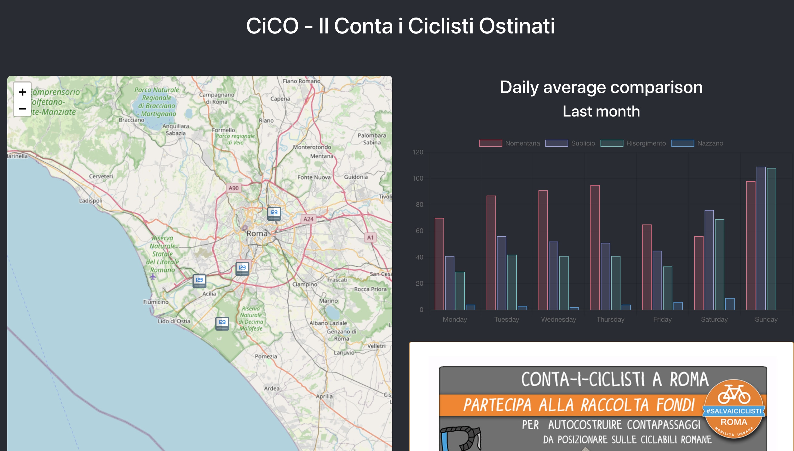

# CiCO - Conta i Ciclisti Ostinati

Conta i Ciclisti is a bottom-up project organized by #Associazione #SalvaiCiclisti #Roma to count cyclists who cycle through Rome every day for any reason: work, leisure or simply go shopping. If  you want to contribute to the funding raising, more info on the project can be found on the page 
[http://www.salvaiciclistiroma.it/](http://www.salvaiciclistiroma.it/sostieni-il-progetto-contaiciclisti/)

Data is collected and provided by [Federico Occhionero](https://nl.mathworks.com/matlabcentral/profile/authors/17274098)



## How to start

Copy file `_env` to `.env` and replace each key with yours

```javascript
cd client
yarn install
yarn run start
```

## Back-end

For the Back-end I am still working on it.
The idea is to store data in MongoDB and use Fastify as server

## TODO

1. Add API specification
2. Add token
3. Add Authentication for users
4. Secure API
